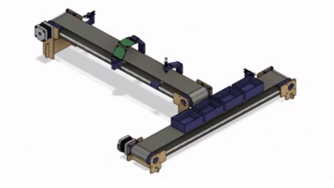

# 🤖 Conveyor Belt Object Detection and Sorting System



A complete end-to-end system that combines computer vision and physical automation to detect, classify, and sort objects on conveyor belts. The system uses deep learning for object classification, sends commands to an Arduino-controlled dual conveyor belt system, and features a fully interactive GUI for real-time monitoring and control.

## 📋 Table of Contents

- [Overview](#-overview)
- [System Architecture](#-system-architecture)
- [Features](#-features)
- [Hardware Requirements](#-hardware-requirements)
- [Software Requirements](#-software-requirements)
- [Installation](#-installation)
- [Arduino Setup](#-arduino-setup)
- [Python Setup](#-python-setup)
- [Usage Guide](#-usage-guide)
- [Technical Details](#-technical-details)
- [Troubleshooting](#-troubleshooting)
- [Future Improvements](#-future-improvements)
- [Contributors](#-contributors)
- [License](#-license)

## 🔍 Overview

This project integrates computer vision with physical automation to create an intelligent object sorting system. Objects are detected using a camera and a TensorFlow/Keras deep learning model, then sorted into corresponding bins by a dual conveyor belt system controlled by Arduino. The entire process is orchestrated by a Python application with a user-friendly GUI.

## 🏗️ System Architecture

The system consists of three main components:

1. **Object Detection (Python)**: Uses TensorFlow/Keras to classify objects via camera.
2. **Control System (Python)**: Processes detections and communicates with Arduino.
3. **Conveyor Controller (Arduino)**: Controls motors and sensors for physical sorting.


## ✨ Features

### 🎥 Computer Vision & AI
- **Custom Model Training**: Capture and train your own object classification model
- **Real-time Detection**: Live classification from webcam feed
- **Confidence Scoring**: Visual display of detection certainty

### 🔄 Conveyor Belt System
- **Dual Conveyor Setup**: Primary feed conveyor and secondary sorting conveyor
- **Color-Based Sorting**: Sort objects into the correct color-coded bins
- **Queue Management**: Smart handling of multiple objects on the belt
- **Adjustable Speed**: NORMAL and SLOW modes for different operational needs

### 💻 User Interface
- **Live Camera Display**: Real-time view of objects being detected
- **Status Monitoring**: Current state of both conveyor systems
- **Control Panel**: Manual controls for all conveyor operations
- **Object Queue**: Visual management of detected objects awaiting processing
- **Event Logging**: Detailed system activity reporting

### 🔄 Serial Communication
- **Reliable Data Exchange**: Robust communication between Python and Arduino
- **Command Protocol**: Well-defined command set for conveyor control
- **Auto-reconnect**: Smart handling of connection issues

## 🔧 Hardware Requirements

### Components List
- 2× Stepper motors (NEMA17 recommended)
- 2× Stepper motor drivers
- 3-4× IR sensors (for object detection and limit positions)
- 1× TCS34725 RGB color sensor
- 1× Arduino Uno/Nano
- 1× Webcam (720p or better recommended)
- Conveyor belt materials (frames, belts, rollers)
- Power supply (12V, 2A minimum)
- Computer with USB ports (for Arduino and webcam connections)

### Wiring Diagram
```
Arduino Connections:
- PIN_DIR1 (5): Direction control for conveyor 1
- PIN_STEP1 (2): Step control for conveyor 1
- PIN_DIR2 (6): Direction control for conveyor 2
- PIN_STEP2 (3): Step control for conveyor 2
- ENTRY_SENSOR (9): IR sensor at conveyor 1 entry
- EXIT_SENSOR (10): IR sensor at conveyor 1 exit
- BOX_LEFT_LIMIT (11): Left limit sensor for conveyor 2
- BOX_RIGHT_LIMIT (12): Right limit sensor for conveyor 2
- I2C connections for TCS34725 RGB color sensor
```

## 💾 Software Requirements

### Arduino Side
- Arduino IDE 1.8.x or higher
- Required libraries:
  - Wire.h
  - Adafruit_TCS34725.h

### Python Side
- Python 3.11.9 or 3.12
- Key packages:
  - tensorflow
  - opencv-python
  - numpy
  - pyserial
  - tkinter

## 🛠️ Installation

### 📥 Arduino Setup

1. **Install Arduino IDE**:
   - Download and install from [arduino.cc](https://www.arduino.cc/en/software)

2. **Install Required Libraries**:
   - In Arduino IDE, go to Tools > Manage Libraries
   - Search for and install "Adafruit TCS34725"

3. **Upload the Code**:
   - Connect your Arduino via USB
   - Select the correct board and port in the IDE
   - Copy the Arduino code from this repository
   - Click Upload

4. **Test the Setup**:
   - Open Serial Monitor at 9600 baud
   - You should see "READY" and "System Ready" messages
   - Test with commands like "STATUS" to verify communication

### 🐍 Python Setup

1. **Clone the Repository**:
   ```bash
   git clone https://github.com/falachabt/Conveyor.git
   cd <repository-folder>
   ```

2. **Create a Virtual Environment**:
   ```bash
   python -m venv env
   source env/bin/activate  # Linux/Mac
   env\Scripts\activate     # Windows
   ```

3. **Install Dependencies**:
   ```bash
   pip install -r requirements.txt
   ```

4. **Configure Settings** (if needed):
   - Edit camera index or serial port in the Python files if required

## 📘 Usage Guide

### 📷 Training Your Own Model

1. **Run the Trainer**:
   ```bash
   python Local_model_trainer.py
   ```

2. **Create Classes and Capture Data**:
   - Press `N` to create new classes
   - Press `C` to capture images for a class
   - Position different objects in front of the camera
   - Collect at least 50-100 images per class

3. **Train the Model**:
   - Press `T` to start training
   - Wait for the process to complete
   - The model will be saved as `interactive_model.h5`

### 🧪 Testing Your Model

1. **Run the Tester**:
   ```bash
   python Local_model_tester.py
   ```

2. **Verify Classifications**:
   - Point the camera at different objects
   - Check that classifications are accurate
   - Make note of any misclassifications

### 🚀 Running the Full System

1. **Start the Main Application**:
   ```bash
   python image_detection_and_communication.py
   ```

2. **Connect to Hardware**:
   - Select the correct camera from the dropdown
   - Enter the correct COM port for Arduino (e.g., COM7)
   - Click "Connect" to establish communication
   - Click "Start Camera" to begin detection

3. **System Operation**:
   - Place objects at the conveyor entry point
   - Watch as they're detected, classified, and sorted
   - Monitor the object queue and system logs

4. **Manual Controls**:
   - Use "STOP", "SLOW MODE", and "NORMAL MODE" buttons as needed
   - Use direction buttons to control conveyor 2
   - Send test classifications using the color buttons
   - Use "RESET" to clear the system state

## 🔍 Technical Details

### ⚙️ Arduino State Machine

The Arduino code implements two state machines:

1. **Conveyor 1 State Machine**:
   - `C1_IDLE`: Waiting for objects
   - `C1_RUNNING`: Moving object toward exit
   - `C1_WAIT_DROP`: Object at exit, waiting for correct box
   - `C1_DROPPING`: Dropping object into box

2. **Conveyor 2 State Machine**:
   - `C2_IDLE`: Waiting for objects on conveyor 1
   - `C2_FINDING_BOX`: Looking for the right color box
   - `C2_POSITIONING`: Fine-tuning box position
   - `C2_READY`: Ready for object drop

### 🔄 Queue Implementation

The Arduino system maintains a color queue:
- Colors are enqueued when received from Python
- Objects are processed FIFO (First In, First Out)
- Queue ensures colors don't exceed object count
- Default to BLUE if queue is empty

### 📡 Communication Protocol

**Python to Arduino Commands**:
- `1`, `2`, `3`, `4`: Add BLUE, BLACK, RED, or YELLOW color to queue
- `STOP`: Stop all conveyor movement
- `SLOW`: Activate slow movement mode
- `NORMAL`: Set normal movement speed
- `RESET`: Reset system state
- `STATUS`: Request system status
- `DIR_LEFT`/`DIR_RIGHT`: Control conveyor 2 direction

**Arduino to Python Messages**:
- `NEW_OBJECT_DETECTED`: Signals a new object at entry
- `Color Reading - R: X, G: Y, B: Z`: Raw color sensor data
- `Detected: COLOR`: Color sensor classification
- `Drop complete. Color: COLOR`: Successful object sort

## ❓ Troubleshooting

### Common Arduino Issues
- **No "READY" message**: Check power and USB connections
- **Unresponsive motors**: Verify wiring and motor driver connections
- **Incorrect color detection**: Adjust color thresholds in Arduino code
- **Objects not dropping**: Check alignment between conveyors

### Common Python Issues
- **Camera not found**: Verify camera index and availability
- **Model not loading**: Ensure `interactive_model.h5` and `class_names.json` exist
- **Serial connection failures**: Check COM port and ensure Arduino is connected
- **GUI not responding**: Check for error messages in console

## 🚀 Future Improvements

- **Multiple Object Tracking**: Handle multiple objects on the belt simultaneously
- **Web Interface**: Remote monitoring and control via browser
- **Data Analytics**: Track sorting statistics and performance metrics
- **Dynamic Color Learning**: Automatic calibration of color thresholds
- **Error Recovery**: Automatic recovery from jam or misclassification events
- **Energy Optimization**: Intelligent power management for motors

## 👥 Contributors

- **Lead Developer**: TENEZEU VOUFO Benny Dieudonné @falachabt
- **Hardware Design**: NEBO FRANC NELSON  & AURELE FOTSO SIME
- **ML Implementation**: TENEZEU VOUFO Benny Dieudonné & THEOPHILE LAHACHE

## 📄 License

This project is licensed under the MIT License - see the LICENSE file for details.

---

## 🙏 Acknowledgments

- Thanks to the TensorFlow team for their excellent machine learning library
- Thanks to Adafruit for their high-quality sensors and libraries
- Special thanks to all contributors who have helped improve this system

---

*Made with ❤️ by benny tenezeu at icam*
